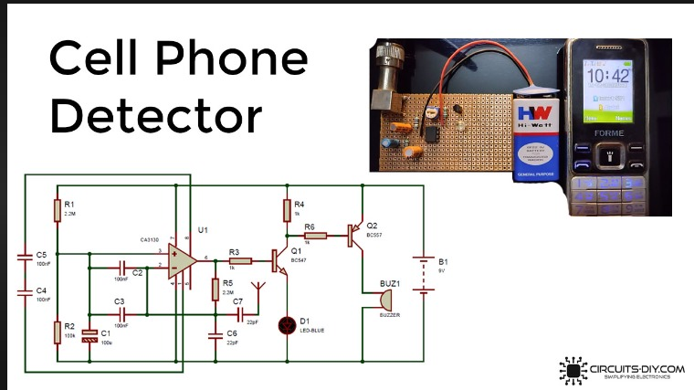
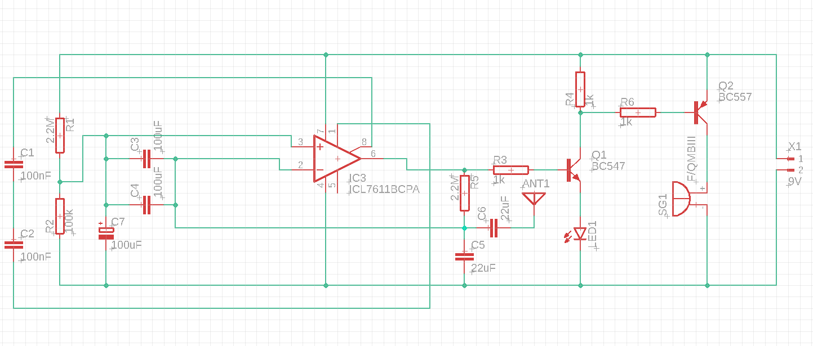
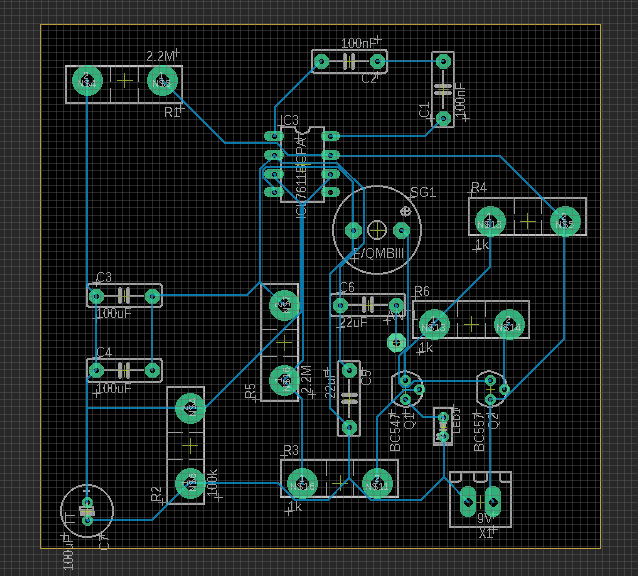

# PCB-Design-Application
# Aim
To design a reliable system capable of detecting and identifying mobile phone transmissions in eagle software.
# Software required
Eagle

# Procedure
1.Open a new schematic file within your project. 
2.Use the libraries provided in EAGLE or create custom libraries if necessary. 
3.Place components onto the schematic sheet by using the 'Add' tool. 
4.Connect the components using the 'Net' tool. 
5.Label nets appropriately to ensure clarity 
6.Once routing is complete, perform a ERC to ensure there are no errors and save the schematic. 
7.Click on the 'Generate/Switch to Board' icon to create a board from your schematic. 
8.EAGLE's board layout editor allows you to place components, route traces, and define board shapes. 
9.Arrange components on the board to optimize space usage and minimize signal interference. 
10.Route traces to connect components according to your schematic. 
11.Use the various routing and editing tools provided by EAGLE to ensure proper routing and avoid design rule violations. 
12.Once routing is complete, perform a design rule check (DRC) to ensure there are no errors and save the board layout. 
13.Go to File > CAM Processor and set up CAM jobs to generate Gerber files for your PCB layers. 
14.Verify generated files to ensure they contain all necessary information. 
15.Save the generated manufacturing files. 

# Theory

Cell phone detector circuits operate on the principle of detecting electromagnetic waves emitted by mobile phones. Mobile phones emit radio frequency (RF) signals during various operations like making calls, sending messages, or connecting to networks. These RF signals fall within a specific frequency range allocated for cellular communication.

The detector circuit typically consists of an antenna to capture RF signals, which are then fed into a signal amplifier to boost their strength for processing. Bandpass filtering is employed to isolate the desired frequency range corresponding to mobile phone signals, while rejecting other noise and interference.

Once the RF signal is amplified and filtered, it undergoes mixing with a local oscillator signal. This mixing process facilitates frequency conversion, allowing the RF signal to be demodulated and extracted for further analysis.

Threshold detection mechanisms are often integrated into the circuit to distinguish between the presence and absence of mobile phone signals. This involves setting a threshold level above which detected signals are considered indicative of cell phone activity.

### Working 

1. Signal Reception: The circuit's antenna captures electromagnetic signals emitted by mobile phones within its range.

2. Signal Amplification: These captured signals are weak and need to be strengthened for processing. An amplifier boosts the signal's strength to make it more detectable.

3. Frequency Filtering: The amplified signal contains a range of frequencies. A filter is applied to isolate the specific frequency bands associated with mobile phone transmissions, while filtering out noise and interference from other sources.

4. Frequency Conversion: The filtered signals are mixed with a local oscillator signal. This mixing process facilitates frequency conversion, allowing the signal to be demodulated and analyzed.

5. Threshold Detection: The demodulated signal is compared to a predetermined threshold level. If the signal strength exceeds this threshold, it indicates the presence of a mobile phone transmission.

6. Alert or Response Mechanism: Upon detection of a signal surpassing the threshold, the circuit triggers an alert mechanism, such as sounding an alarm or activating a notification system. This alerts the operator to the presence of a mobile phone in the monitored area.

7. Sensitivity Adjustment: Sensitivity adjustments may be incorporated to fine-tune the circuit's performance, allowing it to adapt to different signal strengths and environmental conditions.
# Circuit Diagram

# Output

### Schematic diagram

### Layout diagram

# Result

Thus, the reliable system capable of detecting and identifying mobile phone transmissions was designed successfully in eagle software
